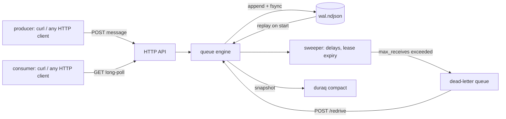

# duraq

[English](README.md) | [中文](README.zh.md) | [日本語](README.ja.md)

[](LICENSE) [](go.mod) [](CHANGELOG.md)  [](CONTRIBUTING.md)

**duraq：オープンソースの純 HTTP 永続メッセージキュー — ロングポーリング、可視性タイムアウト、デッドレターキューを 1 つの静的バイナリに収め、NDJSON の先行書き込みログ（WAL）で裏付ける。覚えるべきブローカープロトコルはなく、あらゆる HTTP クライアントがコンシューマになる。**


```bash
git clone https://github.com/JaydenCJ/duraq && cd duraq
go build -o duraq ./cmd/duraq      # single static binary, stdlib only
./duraq serve --data ./data        # http://127.0.0.1:7333
```

> プレリリース：v0.1.0 はまだパッケージレジストリに公開されていません。上記の通りソースからビルドしてください（Go ≥1.22 で可）。

## なぜ duraq？

どんなバックエンドも遅かれ早かれジョブキューを必要とし、定番の選択肢はどこかで税を課してくる。SQS は便利だ——オフラインで開発したい、データを自分のディスクに置きたい、AWS から離れたいと思うまでは。ElasticMQ はローカルに SQS API を提供するが、JVM を引き連れ、curl では誰も直接叩けない AWS 署名プロトコルを話す。Redis のリストは速いが、`BRPOP` したジョブはワーカーごとクラッシュすれば消え去り、Redis の上に可視性タイムアウトと再試行カウントを載せるのはそれ自体が一つのプロジェクトだ。RabbitMQ はすべて解決する代わりに、AMQP クライアントライブラリと Erlang ランタイムと運用文化を要求する。duraq の賭けはこうだ：多くのサービスが本当に必要とするキュー——永続で、ほぼ FIFO で、再試行され、デッドレターされる——にとって、HTTP こそが既にプロトコルであり、追記専用の NDJSON ファイル 1 つが既にデータベースである。エンキューはすべて WAL に書かれてから送信者に 201 が返る。クラッシュしたサーバはログをリプレイし、リースも無傷のまま中断点から再開する。クライアント SDK は存在しない。包むものがないからだ：`curl` がプロデューサ、`curl` がコンシューマ、`jq` がストレージを監査する。

| | duraq | Amazon SQS | ElasticMQ | Redis リスト |
|---|---|---|---|---|
| コンシューマ要件 | 任意の HTTP クライアント | AWS SDK / SigV4 | AWS SDK / SigV4 | Redis クライアント |
| ジョブがクラッシュを生き残る | ✅ 書き込み毎に WAL | ✅ | ❌ 既定でメモリ内 | ❌ `BRPOP` 後に死ねば消失 |
| 可視性タイムアウト + 再試行カウント | ✅ | ✅ | ✅ | ❌ 自作が必要 |
| デッドレターキュー + リドライブ | ✅ | ✅ | ✅ | ❌ |
| オフライン / 閉域で動く | ✅ | ❌ SaaS | ✅ | ✅ |
| ランタイムの重さ | 静的バイナリ 1 個 | 該当なし | JVM | C サーバ |
| ストレージを grep/jq で監査可能 | ✅ NDJSON | ❌ | ❌ | ❌ RDB/AOF バイナリ |

<sub>2026-07-13 時点で確認：duraq は Go 標準ライブラリのみをインポート。ElasticMQ 1.6 は JRE を要する約 40 MB の JAR。Redis で at-least-once 配送を行うにはクライアント側のリース実装（例：ソート済みセットにタイムスタンプ）が必要。</sub>

## 特長

- **構造からして永続** — すべての状態遷移（send・lease・ack・デッドレター）は追記専用 NDJSON ログへ fsync されてから確認応答される。再起動時はログをリプレイし、電源断による欠損末尾は検出して切り詰める。
- **websocket 不要のロングポーリング** — `GET /q/jobs/messages?wait=20` はメッセージ到着か待機満了までリクエストを保留する。空なら素の 204 が返るだけなので、シェルループのワーカーは 3 行で書ける。
- **可視性タイムアウトを正しく** — コンシューマが死ねば、リース切れのメッセージは新しい receipt 付きで再配送される。古い receipt には二重 ack ではなく 409 を返し、遅いワーカーは処理中に `extend` で延長できる。
- **デッドレターキュー + リドライブ** — `max_receives` が毒メッセージを自動で DLQ へ移す。バグを直したら `POST /redrive` 一発で戻り、受信カウントはリセットされる。
- **再配送に耐える FIFO** — 期限切れのメッセージは列の最後尾ではなく元の位置へ戻る。順序は常に送信シーケンス順。
- **読めるキュー** — ストレージは 1 行 1 JSON オブジェクト。`tail -f` でライブ観察、`grep` で迷子のジョブを発見、`jq` でアドホック集計、`duraq compact` で履歴を生存状態まで圧縮。
- **依存ゼロ・テレメトリゼロ** — Go 標準ライブラリのみ。既定で `127.0.0.1` にのみバインドし、どこへも何も送信しない。

## クイックスタート

```bash
./duraq serve --data ./data &
curl -X PUT 127.0.0.1:7333/q/jobs \
  -d '{"visibility_timeout":"30s","max_receives":5,"dead_letter":"jobs.dlq"}'
curl -X POST 127.0.0.1:7333/q/jobs/messages -d '{"task":"resize","src":"cat.png"}'
curl '127.0.0.1:7333/q/jobs/messages?wait=20'
```

上の receive の実測出力：

```text
{
  "messages": [
    {
      "id": "0000000000000001",
      "receipt": "r0000000000000002",
      "body": "{\"task\":\"resize\",\"src\":\"cat.png\"}",
      "receives": 1,
      "sent_at": "2026-07-13T04:45:38.568902741Z"
    }
  ]
}
```

receipt を添えて ack すれば、このジョブは永久に完了する（実測出力：`204`）：

```bash
curl -X DELETE '127.0.0.1:7333/q/jobs/messages/0000000000000001?receipt=r0000000000000002'
```

その間、WAL は物語の全部を 1 行 1 イベントで語っている：

```text
{"op":"qcreate","q":"jobs","ts":1783917938520,"cfg":{"visibility_timeout":"30s","max_receives":5,"dead_letter":"jobs.dlq"}}
{"op":"send","q":"jobs","id":"0000000000000001","body":"{\"task\":\"resize\",\"src\":\"cat.png\"}","ts":1783917938568}
{"op":"recv","q":"jobs","id":"0000000000000001","ts":1783917938593,"deadline":1783917968593,"receipt":"r0000000000000002","count":1}
{"op":"ack","q":"jobs","id":"0000000000000001","ts":1783917938618,"receipt":"r0000000000000002"}
```

完全なポーリングワーカーはシェルループ 1 つ — その例とプロデューサは [examples/](examples/) にある。

## HTTP API

ボディは生のメッセージペイロードか JSON。エラーは常に `{"error":{"code","message"}}`。時間指定は `30s`/`1m` または素の秒数を受け付ける。

| メソッドとパス | 効果 |
|---|---|
| `PUT /q/{name}` | キュー作成（201）または設定更新（200） |
| `GET /q` · `GET /q/{name}` | キュー一覧 / 単一キューの統計 |
| `DELETE /q/{name}` | キューと全メッセージを削除 |
| `POST /q/{name}/messages?delay=10s` | 生ボディをエンキュー、遅延も可（≤15m） |
| `GET /q/{name}/messages?wait=20&max=10&visibility=1m` | 受信：ロングポーリング ≤60s、バッチ ≤100、リースは呼び出し毎に上書き可 |
| `DELETE /q/{name}/messages/{id}?receipt=R` | ack — 204 で完了、リース喪失なら 409 |
| `POST /q/{name}/messages/{id}/nack?receipt=R` | 即座にキューへ戻す（回数を使い切れば DLQ 行き） |
| `POST /q/{name}/messages/{id}/extend?receipt=R&visibility=2m` | リース期限を先へ延ばす |
| `POST /q/{name}/redrive?to=jobs&max=100` | 準備完了メッセージを別キューへ移し、受信カウントをリセット |
| `GET /healthz` · `GET /version` | 死活確認とバージョン |

## キュー設定

`PUT /q/{name}` のボディでキュー毎に設定する。各フィールドは省略可。

| キー | 既定値 | 効果 |
|---|---|---|
| `visibility_timeout` | `30s` | 受信後のメッセージが再配送まで不可視でいる時間（≤12h） |
| `max_receives` | `0`（無制限） | ack なしの受信がこの回数に達するとデッドレターへ |
| `dead_letter` | — | 毒メッセージの移動先キュー（自動作成）。`max_receives` を設定しつつ未設定なら破棄 |

メッセージ本体は最大 1 MiB の任意バイト列：UTF-8 ペイロードは素の文字列として転送・永続化され、それ以外は base64（`body_b64`）になる。操作毎の完全なログ schema は [docs/wal-format.md](docs/wal-format.md) を参照。

## 検証

このリポジトリは CI を同梱しない。上記の主張はすべてローカル実行で検証される：

```bash
go test ./...            # 90 deterministic tests, offline, < 3 s
bash scripts/smoke.sh    # builds, serves, drives curl end-to-end, prints SMOKE OK
```

## アーキテクチャ



## ロードマップ

- [x] v0.1.0 — 欠損末尾リカバリと圧縮を備えた NDJSON WAL、キュー CRUD、send/receive/ack/nack/extend、ロングポーリング、遅延、可視性タイムアウト、DLQ + リドライブ、オフライン stats、90 テスト + smoke スクリプト
- [ ] ログ内の死んだレコード比率が閾値を超えたら自動圧縮
- [ ] リースせずにメッセージを覗ける、カーソル不要の `GET /q/{name}/peek`
- [ ] ループバック外デプロイ向けの任意の bearer トークン認証
- [ ] メッセージ毎の TTL / 保持期間の制限
- [ ] Prometheus 形式の `/metrics`

全リストは [open issues](https://github.com/JaydenCJ/duraq/issues) を参照。

## コントリビュート

Issue・ディスカッション・pull request を歓迎 — ローカルのワークフロー（フォーマット、vet、テスト、`SMOKE OK`）は [CONTRIBUTING.md](CONTRIBUTING.md) を参照。入門向けタスクは [good first issue](https://github.com/JaydenCJ/duraq/issues?q=is%3Aissue+is%3Aopen+label%3A%22good+first+issue%22) のラベル付き、設計の議論は [Discussions](https://github.com/JaydenCJ/duraq/discussions) で。

## ライセンス

[MIT](LICENSE)
