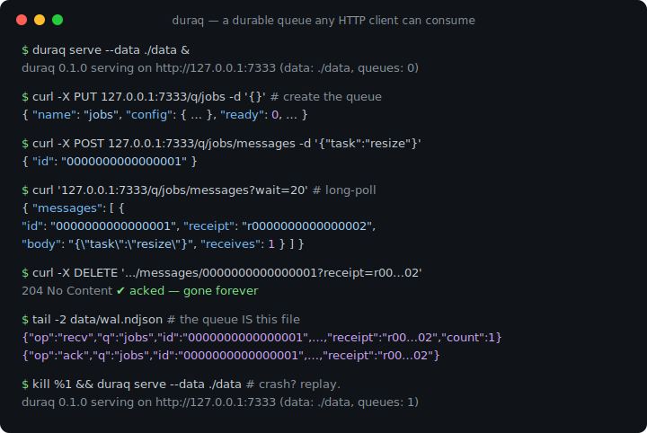
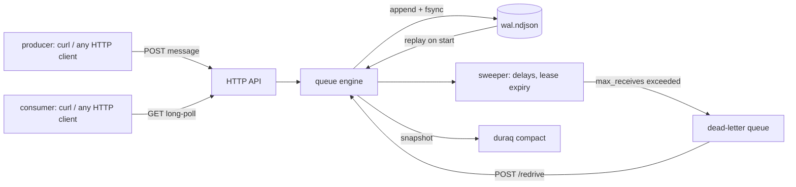

# duraq

[English](README.md) | [中文](README.zh.md) | [日本語](README.ja.md)

[](LICENSE) [](go.mod) [](CHANGELOG.md)  [](CONTRIBUTING.md)

**duraq：an open-source durable message queue over plain HTTP — long-poll, visibility timeouts, and dead-letter queues in one static binary, backed by an NDJSON write-ahead log. No broker protocol to learn; any HTTP client is a consumer.**



```bash
git clone https://github.com/JaydenCJ/duraq && cd duraq
go build -o duraq ./cmd/duraq      # single static binary, stdlib only
./duraq serve --data ./data        # http://127.0.0.1:7333
```

> Pre-release: v0.1.0 is not tagged on a package registry yet; build from source as above (any Go ≥1.22).

## Why duraq?

Every backend eventually needs a job queue, and the standard options all tax you somewhere. SQS works — until you need to develop offline, keep data on your own disk, or leave AWS; ElasticMQ gives you the SQS API locally but drags in a JVM and speaks a signed AWS wire protocol that no human can drive with curl. Redis lists are fast but a `BRPOP`ped job that crashes with its worker is simply gone, and adding visibility timeouts plus retry accounting on top of Redis is a project of its own. RabbitMQ solves all of it and charges you an AMQP client library, an Erlang runtime, and a management culture. duraq's bet: for the queue most services actually need — durable, FIFO-ish, retried, dead-lettered — HTTP is already the protocol, and a single append-only NDJSON file is already the database. Every enqueue hits the write-ahead log before the sender gets its 201; a crashed server replays the log and picks up where it stopped, leases intact. There is no client SDK because there is nothing to wrap: `curl` is a producer, `curl` is a consumer, and `jq` audits the storage.

| | duraq | Amazon SQS | ElasticMQ | Redis lists |
|---|---|---|---|---|
| Consumer requirement | any HTTP client | AWS SDK / SigV4 | AWS SDK / SigV4 | Redis client |
| Jobs survive a crash | ✅ WAL per write | ✅ | ❌ in-memory default | ❌ lost on `BRPOP` + die |
| Visibility timeout + retry count | ✅ | ✅ | ✅ | ❌ build it yourself |
| Dead-letter queues + redrive | ✅ | ✅ | ✅ | ❌ |
| Runs offline / air-gapped | ✅ | ❌ SaaS | ✅ | ✅ |
| Runtime footprint | 1 static binary | n/a | JVM | C server |
| Storage auditable with grep/jq | ✅ NDJSON | ❌ | ❌ | ❌ RDB/AOF binary |

<sub>Checked 2026-07-13: duraq imports the Go standard library only; ElasticMQ 1.6 ships as a ~40 MB JAR requiring a JRE; Redis needs client-side lease logic (e.g. via sorted-set timestamps) for at-least-once delivery.</sub>

## Features

- **Durable by construction** — every state change (send, lease, ack, dead-letter) is fsynced to an append-only NDJSON log before it is acknowledged; restart replays the log, and torn tails from power loss are detected and truncated.
- **Long-polling without websockets** — `GET /q/jobs/messages?wait=20` parks the request until a message arrives or the wait elapses; a plain 204 means "empty", so shell-loop workers are three lines.
- **Visibility timeouts done right** — leased messages redeliver with a fresh receipt if the consumer dies, stale receipts get a 409 instead of double-acking, and slow workers can `extend` their lease mid-job.
- **Dead-letter queues + redrive** — `max_receives` moves poison messages to a DLQ automatically; one `POST /redrive` moves them back after you fix the bug, receive counts reset.
- **FIFO that survives redelivery** — an expired message returns to its original queue position, not the back of the line; ordering is by send sequence, always.
- **A queue you can read** — the storage is one JSON object per line: `tail -f` watches it live, `grep` finds a lost job, `jq` computes ad-hoc stats, and `duraq compact` shrinks history to live state.
- **Zero dependencies, zero telemetry** — Go standard library only, binds `127.0.0.1` by default, sends nothing anywhere, ever.

## Quickstart

```bash
./duraq serve --data ./data &
curl -X PUT 127.0.0.1:7333/q/jobs \
  -d '{"visibility_timeout":"30s","max_receives":5,"dead_letter":"jobs.dlq"}'
curl -X POST 127.0.0.1:7333/q/jobs/messages -d '{"task":"resize","src":"cat.png"}'
curl '127.0.0.1:7333/q/jobs/messages?wait=20'
```

Real captured output of that receive:

```text
{
  "messages": [
    {
      "id": "0000000000000001",
      "receipt": "r0000000000000002",
      "body": "{\"task\":\"resize\",\"src\":\"cat.png\"}",
      "receives": 1,
      "sent_at": "2026-07-13T04:45:38.568902741Z"
    }
  ]
}
```

Ack it with the receipt, and the job is done forever (real output: `204`):

```bash
curl -X DELETE '127.0.0.1:7333/q/jobs/messages/0000000000000001?receipt=r0000000000000002'
```

Meanwhile the write-ahead log tells the whole story, one JSON line per event:

```text
{"op":"qcreate","q":"jobs","ts":1783917938520,"cfg":{"visibility_timeout":"30s","max_receives":5,"dead_letter":"jobs.dlq"}}
{"op":"send","q":"jobs","id":"0000000000000001","body":"{\"task\":\"resize\",\"src\":\"cat.png\"}","ts":1783917938568}
{"op":"recv","q":"jobs","id":"0000000000000001","ts":1783917938593,"deadline":1783917968593,"receipt":"r0000000000000002","count":1}
{"op":"ack","q":"jobs","id":"0000000000000001","ts":1783917938618,"receipt":"r0000000000000002"}
```

A complete polling worker is a shell loop — see [examples/](examples/) for this and a producer.

## HTTP API

All bodies are raw message payloads or JSON; errors are always `{"error":{"code","message"}}`. Durations accept `30s`/`1m` or bare seconds.

| Method & path | Effect |
|---|---|
| `PUT /q/{name}` | create queue (201) or update its config (200) |
| `GET /q` · `GET /q/{name}` | list queues / one queue's stats |
| `DELETE /q/{name}` | delete queue and all its messages |
| `POST /q/{name}/messages?delay=10s` | enqueue raw body, optionally delayed (≤15m) |
| `GET /q/{name}/messages?wait=20&max=10&visibility=1m` | receive: long-poll ≤60s, batch ≤100, per-call lease override |
| `DELETE /q/{name}/messages/{id}?receipt=R` | ack — 204 done, 409 if the lease was lost |
| `POST /q/{name}/messages/{id}/nack?receipt=R` | return to queue immediately (or dead-letter if exhausted) |
| `POST /q/{name}/messages/{id}/extend?receipt=R&visibility=2m` | push the lease deadline forward |
| `POST /q/{name}/redrive?to=jobs&max=100` | move ready messages to another queue, receive counts reset |
| `GET /healthz` · `GET /version` | liveness and version |

## Queue configuration

Set per queue via the `PUT /q/{name}` body; every field is optional.

| Key | Default | Effect |
|---|---|---|
| `visibility_timeout` | `30s` | how long a received message stays invisible before redelivery (≤12h) |
| `max_receives` | `0` (unlimited) | receives without an ack before a message is dead-lettered |
| `dead_letter` | — | queue that poison messages move to (auto-created); unset with `max_receives` set means they are dropped |

Message bodies are arbitrary bytes up to 1 MiB: UTF-8 payloads travel and persist as plain strings, anything else as base64 (`body_b64`). The full per-op log schema is in [docs/wal-format.md](docs/wal-format.md).

## Verification

This repository ships no CI; every claim above is verified by local runs:

```bash
go test ./...            # 90 deterministic tests, offline, < 3 s
bash scripts/smoke.sh    # builds, serves, drives curl end-to-end, prints SMOKE OK
```

## Architecture



## Roadmap

- [x] v0.1.0 — NDJSON WAL with torn-tail recovery and compaction, queue CRUD, send/receive/ack/nack/extend, long-poll, delays, visibility timeouts, DLQ + redrive, offline stats, 90 tests + smoke script
- [ ] Auto-compaction when the log's dead-record ratio crosses a threshold
- [ ] Cursor-free `GET /q/{name}/peek` for inspecting messages without leasing
- [ ] Optional bearer-token auth for non-loopback deployments
- [ ] Per-message TTL / retention limits
- [ ] Prometheus-format `/metrics`

See the [open issues](https://github.com/JaydenCJ/duraq/issues) for the full list.

## Contributing

Issues, discussions and pull requests are welcome — see [CONTRIBUTING.md](CONTRIBUTING.md) for the local workflow (format, vet, tests, `SMOKE OK`). Good entry points are labelled [good first issue](https://github.com/JaydenCJ/duraq/issues?q=is%3Aissue+is%3Aopen+label%3A%22good+first+issue%22), and design questions live in [Discussions](https://github.com/JaydenCJ/duraq/discussions).

## License

[MIT](LICENSE)
