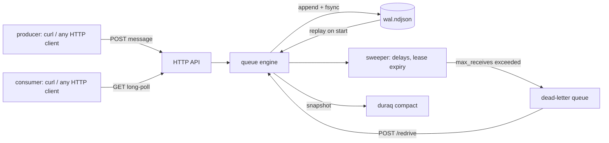

# duraq

[English](README.md) | [中文](README.zh.md) | [日本語](README.ja.md)

[](LICENSE) [](go.mod) [](CHANGELOG.md)  [](CONTRIBUTING.md)

**duraq：开源的纯 HTTP 持久化消息队列 —— 长轮询、可见性超时、死信队列，全部装进一个静态二进制，底层是 NDJSON 预写日志。没有 broker 协议要学；任何 HTTP 客户端都是消费者。**


```bash
git clone https://github.com/JaydenCJ/duraq && cd duraq
go build -o duraq ./cmd/duraq      # single static binary, stdlib only
./duraq serve --data ./data        # http://127.0.0.1:7333
```

> 预发布：v0.1.0 尚未发布到任何包仓库；请按上面的方式从源码构建（Go ≥1.22 均可）。

## 为什么选 duraq？

每个后端迟早都需要一个任务队列，而标准选项都会在某处收税。SQS 好用——直到你需要离线开发、把数据留在自己磁盘上、或者离开 AWS；ElasticMQ 在本地提供 SQS API，却拖着一个 JVM，说的还是没人能用 curl 直接驱动的 AWS 签名协议。Redis 列表很快，但 `BRPOP` 出来的任务随 worker 一起崩溃就彻底没了，在 Redis 之上补可见性超时和重试计数本身就是一个项目。RabbitMQ 什么都解决，代价是一个 AMQP 客户端库、一个 Erlang 运行时和一整套运维文化。duraq 的赌注是：对于多数服务真正需要的那种队列——持久、大致 FIFO、可重试、有死信——HTTP 本身就是协议，一个仅追加的 NDJSON 文件本身就是数据库。每次入队都先落预写日志，发送方才拿到 201；服务器崩溃后重放日志，从断点继续，租约完好。没有客户端 SDK，因为没什么可封装的：`curl` 是生产者，`curl` 是消费者，`jq` 负责审计存储。

| | duraq | Amazon SQS | ElasticMQ | Redis 列表 |
|---|---|---|---|---|
| 消费者要求 | 任意 HTTP 客户端 | AWS SDK / SigV4 | AWS SDK / SigV4 | Redis 客户端 |
| 任务在崩溃后存活 | ✅ 每次写入进 WAL | ✅ | ❌ 默认纯内存 | ❌ `BRPOP` 后挂掉即丢 |
| 可见性超时 + 重试计数 | ✅ | ✅ | ✅ | ❌ 得自己造 |
| 死信队列 + 重驱回收 | ✅ | ✅ | ✅ | ❌ |
| 离线 / 内网可用 | ✅ | ❌ SaaS | ✅ | ✅ |
| 运行时体积 | 1 个静态二进制 | 不适用 | JVM | C 服务器 |
| 存储可用 grep/jq 审计 | ✅ NDJSON | ❌ | ❌ | ❌ RDB/AOF 二进制 |

<sub>核对于 2026-07-13：duraq 只导入 Go 标准库；ElasticMQ 1.6 是一个约 40 MB 的 JAR，需要 JRE；Redis 要实现至少一次投递需在客户端自建租约逻辑（例如用有序集合存时间戳）。</sub>

## 特性

- **构造上即持久** —— 每次状态变更（send、lease、ack、死信）都先 fsync 到仅追加的 NDJSON 日志再确认；重启时重放日志，掉电产生的残尾会被检测并截断。
- **不用 websocket 的长轮询** —— `GET /q/jobs/messages?wait=20` 会挂起请求，直到消息到达或等待期满；空队列就是一个普通的 204，shell 循环 worker 三行写完。
- **把可见性超时做对** —— 消费者挂掉后，租约到期的消息带新 receipt 重新投递；过期 receipt 得到 409 而不是重复 ack；慢 worker 可以在处理中途 `extend` 续租。
- **死信队列 + 重驱** —— `max_receives` 自动把毒消息移入 DLQ；修好 bug 后一个 `POST /redrive` 把它们移回来，接收计数清零。
- **经得起重投递的 FIFO** —— 过期消息回到它原本的队列位置，而不是队尾；顺序永远按发送序列。
- **一个你能读懂的队列** —— 存储就是一行一个 JSON 对象：`tail -f` 实时观看，`grep` 找回丢失的任务，`jq` 做临时统计，`duraq compact` 把历史压缩成存活状态。
- **零依赖、零遥测** —— 仅 Go 标准库，默认只绑定 `127.0.0.1`，永远不向任何地方发送任何东西。

## 快速上手

```bash
./duraq serve --data ./data &
curl -X PUT 127.0.0.1:7333/q/jobs \
  -d '{"visibility_timeout":"30s","max_receives":5,"dead_letter":"jobs.dlq"}'
curl -X POST 127.0.0.1:7333/q/jobs/messages -d '{"task":"resize","src":"cat.png"}'
curl '127.0.0.1:7333/q/jobs/messages?wait=20'
```

上面那次 receive 的真实输出：

```text
{
  "messages": [
    {
      "id": "0000000000000001",
      "receipt": "r0000000000000002",
      "body": "{\"task\":\"resize\",\"src\":\"cat.png\"}",
      "receives": 1,
      "sent_at": "2026-07-13T04:45:38.568902741Z"
    }
  ]
}
```

带上 receipt 去 ack，这个任务就永远完成了（真实输出：`204`）：

```bash
curl -X DELETE '127.0.0.1:7333/q/jobs/messages/0000000000000001?receipt=r0000000000000002'
```

与此同时，预写日志完整记录了整个故事，一行一个事件：

```text
{"op":"qcreate","q":"jobs","ts":1783917938520,"cfg":{"visibility_timeout":"30s","max_receives":5,"dead_letter":"jobs.dlq"}}
{"op":"send","q":"jobs","id":"0000000000000001","body":"{\"task\":\"resize\",\"src\":\"cat.png\"}","ts":1783917938568}
{"op":"recv","q":"jobs","id":"0000000000000001","ts":1783917938593,"deadline":1783917968593,"receipt":"r0000000000000002","count":1}
{"op":"ack","q":"jobs","id":"0000000000000001","ts":1783917938618,"receipt":"r0000000000000002"}
```

一个完整的轮询 worker 就是一个 shell 循环 —— 这个例子和一个生产者都在 [examples/](examples/)。

## HTTP API

请求体要么是原始消息负载要么是 JSON；错误永远是 `{"error":{"code","message"}}`。时长接受 `30s`/`1m` 或纯秒数。

| 方法与路径 | 效果 |
|---|---|
| `PUT /q/{name}` | 创建队列（201）或更新其配置（200） |
| `GET /q` · `GET /q/{name}` | 列出所有队列 / 单个队列的统计 |
| `DELETE /q/{name}` | 删除队列及其全部消息 |
| `POST /q/{name}/messages?delay=10s` | 入队原始请求体，可选延迟（≤15m） |
| `GET /q/{name}/messages?wait=20&max=10&visibility=1m` | 接收：长轮询 ≤60s，批量 ≤100，可按次覆盖租期 |
| `DELETE /q/{name}/messages/{id}?receipt=R` | ack —— 204 完成，租约已失则 409 |
| `POST /q/{name}/messages/{id}/nack?receipt=R` | 立即退回队列（次数耗尽则进死信） |
| `POST /q/{name}/messages/{id}/extend?receipt=R&visibility=2m` | 把租约截止时间往后推 |
| `POST /q/{name}/redrive?to=jobs&max=100` | 把就绪消息移入另一队列，接收计数清零 |
| `GET /healthz` · `GET /version` | 存活探测与版本 |

## 队列配置

通过 `PUT /q/{name}` 的请求体按队列设置；每个字段都可选。

| 键 | 默认值 | 效果 |
|---|---|---|
| `visibility_timeout` | `30s` | 消息被接收后保持不可见多久才重投递（≤12h） |
| `max_receives` | `0`（不限） | 未 ack 的接收次数达到该值即进入死信 |
| `dead_letter` | — | 毒消息移入的队列（自动创建）；设置了 `max_receives` 却不设此项则直接丢弃 |

消息体是至多 1 MiB 的任意字节：UTF-8 负载以普通字符串传输和持久化，其余用 base64（`body_b64`）。完整的按操作日志 schema 见 [docs/wal-format.md](docs/wal-format.md)。

## 验证

本仓库不带 CI；上面的每一条声明都由本地运行验证：

```bash
go test ./...            # 90 deterministic tests, offline, < 3 s
bash scripts/smoke.sh    # builds, serves, drives curl end-to-end, prints SMOKE OK
```

## 架构



## 路线图

- [x] v0.1.0 —— 带残尾恢复与压缩的 NDJSON WAL、队列 CRUD、send/receive/ack/nack/extend、长轮询、延迟、可见性超时、DLQ + 重驱、离线 stats、90 个测试 + smoke 脚本
- [ ] 日志中死记录比例超阈值时自动压缩
- [ ] 无游标的 `GET /q/{name}/peek`，不租约地查看消息
- [ ] 面向非回环部署的可选 bearer token 认证
- [ ] 按消息的 TTL / 保留期限制
- [ ] Prometheus 格式的 `/metrics`

完整列表见 [open issues](https://github.com/JaydenCJ/duraq/issues)。

## 参与贡献

欢迎 issue、讨论与 pull request —— 本地工作流（格式化、vet、测试、`SMOKE OK`）见 [CONTRIBUTING.md](CONTRIBUTING.md)。入门任务标注为 [good first issue](https://github.com/JaydenCJ/duraq/issues?q=is%3Aissue+is%3Aopen+label%3A%22good+first+issue%22)，设计讨论在 [Discussions](https://github.com/JaydenCJ/duraq/discussions)。

## 许可证

[MIT](LICENSE)
